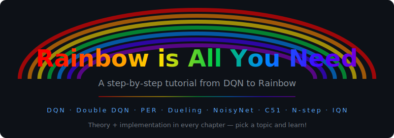

<div align="center">



[](#contributors)

</div>

This is a step-by-step tutorial from DQN to Rainbow.
Every chapter contains both of theoretical backgrounds and object-oriented implementation. Just pick any topic in which you are interested, and learn! You can run them directly in the cloud with [molab](https://molab.marimo.io/) — no local setup needed.

Built with [marimo](https://marimo.io/) — a reactive Python notebook that runs as a pure `.py` file with better reproducibility, git diffs, and interactive UI.

Please feel free to open an issue or a pull-request if you have any idea to make it better. :)

>If you want a tutorial for policy gradient methods, please see [PG is All You Need](https://github.com/MrSyee/pg-is-all-you-need).

## Contents

01. DQN [[GitHub](01_dqn.py)] [[Preview](https://molab.marimo.io/github/Curt-Park/rainbow-is-all-you-need/blob/master/01_dqn.py)]
02. DoubleDQN [[GitHub](02_double_q.py)] [[Preview](https://molab.marimo.io/github/Curt-Park/rainbow-is-all-you-need/blob/master/02_double_q.py)]
03. PrioritizedExperienceReplay [[GitHub](03_per.py)] [[Preview](https://molab.marimo.io/github/Curt-Park/rainbow-is-all-you-need/blob/master/03_per.py)]
04. DuelingNet [[GitHub](04_dueling.py)] [[Preview](https://molab.marimo.io/github/Curt-Park/rainbow-is-all-you-need/blob/master/04_dueling.py)]
05. NoisyNet [[GitHub](05_noisy_net.py)] [[Preview](https://molab.marimo.io/github/Curt-Park/rainbow-is-all-you-need/blob/master/05_noisy_net.py)]
06. CategoricalDQN [[GitHub](06_categorical_dqn.py)] [[Preview](https://molab.marimo.io/github/Curt-Park/rainbow-is-all-you-need/blob/master/06_categorical_dqn.py)]
07. N-stepLearning [[GitHub](07_n_step_learning.py)] [[Preview](https://molab.marimo.io/github/Curt-Park/rainbow-is-all-you-need/blob/master/07_n_step_learning.py)]
08. Rainbow [[GitHub](08_rainbow.py)] [[Preview](https://molab.marimo.io/github/Curt-Park/rainbow-is-all-you-need/blob/master/08_rainbow.py)]
09. Rainbow IQN [[GitHub](09_rainbow_iqn.py)] [[Preview](https://molab.marimo.io/github/Curt-Park/rainbow-is-all-you-need/blob/master/09_rainbow_iqn.py)]

> Click **"Run in molab"** on the preview page to open an interactive session where you can edit and run the notebook.

## Prerequisites

```bash
# Install mise
curl https://mise.run | sh

# Clone the project
git clone https://github.com/Curt-Park/rainbow-is-all-you-need.git
cd rainbow-is-all-you-need

# Install Python + Create venv + Install Python packages
make init
make setup
```

## How to Run

Run and experiment with any notebook:
```
make run notebook=01_dqn.py
```

## Development

```
make format    # run the formatter
make lint      # run the linter
```

## Related Papers

01. [V. Mnih et al., "Human-level control through deep reinforcement learning." Nature, 518
(7540):529–533, 2015.](https://storage.googleapis.com/deepmind-media/dqn/DQNNaturePaper.pdf)
02. [van Hasselt et al., "Deep Reinforcement Learning with Double Q-learning." arXiv preprint arXiv:1509.06461, 2015.](https://arxiv.org/pdf/1509.06461.pdf)
03. [T. Schaul et al., "Prioritized Experience Replay." arXiv preprint arXiv:1511.05952, 2015.](https://arxiv.org/pdf/1511.05952.pdf)
04. [Z. Wang et al., "Dueling Network Architectures for Deep Reinforcement Learning." arXiv preprint arXiv:1511.06581, 2015.](https://arxiv.org/pdf/1511.06581.pdf)
05. [M. Fortunato et al., "Noisy Networks for Exploration." arXiv preprint arXiv:1706.10295, 2017.](https://arxiv.org/pdf/1706.10295.pdf)
06. [M. G. Bellemare et al., "A Distributional Perspective on Reinforcement Learning." arXiv preprint arXiv:1707.06887, 2017.](https://arxiv.org/pdf/1707.06887.pdf)
07. [R. S. Sutton, "Learning to predict by the methods of temporal differences." Machine learning, 3(1):9–44, 1988.](http://incompleteideas.net/papers/sutton-88-with-erratum.pdf)
08. [M. Hessel et al., "Rainbow: Combining Improvements in Deep Reinforcement Learning." arXiv preprint arXiv:1710.02298, 2017.](https://arxiv.org/pdf/1710.02298.pdf)
09. [W. Dabney et al., "Implicit Quantile Networks for Distributional Reinforcement Learning." arXiv preprint arXiv:1806.06923, 2018.](https://arxiv.org/pdf/1806.06923.pdf)

## Contributors

Thanks goes to these wonderful people ([emoji key](https://allcontributors.org/docs/en/emoji-key)):

<!-- ALL-CONTRIBUTORS-LIST:START - Do not remove or modify this section -->
<!-- prettier-ignore-start -->
<!-- markdownlint-disable -->
<table>
  <tbody>
    <tr>
      <td align="center" valign="top" width="14.28%"><a href="https://www.linkedin.com/in/curt-park/"><br /><sub><b>Jinwoo Park (Curt)</b></sub></a><br /><a href="https://github.com/Curt-Park/rainbow-is-all-you-need/commits?author=Curt-Park" title="Code">💻</a> <a href="https://github.com/Curt-Park/rainbow-is-all-you-need/commits?author=Curt-Park" title="Documentation">📖</a></td>
      <td align="center" valign="top" width="14.28%"><a href="https://www.linkedin.com/in/kyunghwan-kim-0739a314a/"><br /><sub><b>Kyunghwan Kim</b></sub></a><br /><a href="https://github.com/Curt-Park/rainbow-is-all-you-need/commits?author=MrSyee" title="Code">💻</a></td>
      <td align="center" valign="top" width="14.28%"><a href="https://github.com/Wei-1"><br /><sub><b>Wei Chen</b></sub></a><br /><a href="#maintenance-Wei-1" title="Maintenance">🚧</a></td>
      <td align="center" valign="top" width="14.28%"><a href="https://github.com/wlbksy"><br /><sub><b>WANG Lei</b></sub></a><br /><a href="#maintenance-wlbksy" title="Maintenance">🚧</a></td>
      <td align="center" valign="top" width="14.28%"><a href="https://www.tun6.com/"><br /><sub><b>leeyaf</b></sub></a><br /><a href="https://github.com/Curt-Park/rainbow-is-all-you-need/commits?author=leeyaf" title="Code">💻</a></td>
      <td align="center" valign="top" width="14.28%"><a href="https://github.com/AFanaei"><br /><sub><b>ahmadF</b></sub></a><br /><a href="https://github.com/Curt-Park/rainbow-is-all-you-need/commits?author=AFanaei" title="Documentation">📖</a></td>
      <td align="center" valign="top" width="14.28%"><a href="https://github.com/robertoschiavone"><br /><sub><b>Roberto Schiavone</b></sub></a><br /><a href="https://github.com/Curt-Park/rainbow-is-all-you-need/commits?author=robertoschiavone" title="Code">💻</a></td>
    </tr>
    <tr>
      <td align="center" valign="top" width="14.28%"><a href="https://github.com/DaivdYuan"><br /><sub><b>David Yuan</b></sub></a><br /><a href="https://github.com/Curt-Park/rainbow-is-all-you-need/commits?author=DaivdYuan" title="Code">💻</a></td>
      <td align="center" valign="top" width="14.28%"><a href="https://github.com/dhanushka2001"><br /><sub><b>dhanushka2001</b></sub></a><br /><a href="https://github.com/Curt-Park/rainbow-is-all-you-need/commits?author=dhanushka2001" title="Code">💻</a></td>
      <td align="center" valign="top" width="14.28%"><a href="https://pierre-couy.dev"><br /><sub><b>Pierre Couy</b></sub></a><br /><a href="https://github.com/Curt-Park/rainbow-is-all-you-need/commits?author=pcouy" title="Code">💻</a></td>
      <td align="center" valign="top" width="14.28%"><a href="https://anthropic.com/claude-code"><br /><sub><b>Claude</b></sub></a><br /><a href="https://github.com/Curt-Park/rainbow-is-all-you-need/commits?author=claude" title="Code">💻</a></td>
    </tr>
  </tbody>
</table>

<!-- markdownlint-restore -->
<!-- prettier-ignore-end -->

<!-- ALL-CONTRIBUTORS-LIST:END -->

This project follows the [all-contributors](https://github.com/all-contributors/all-contributors) specification. Contributions of any kind welcome!
